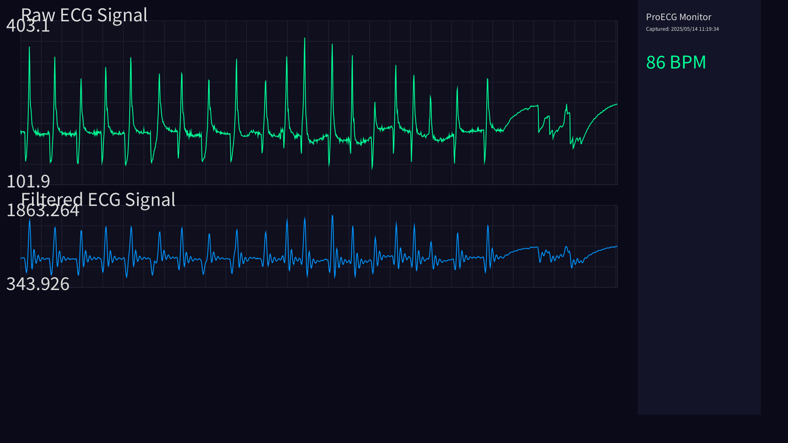
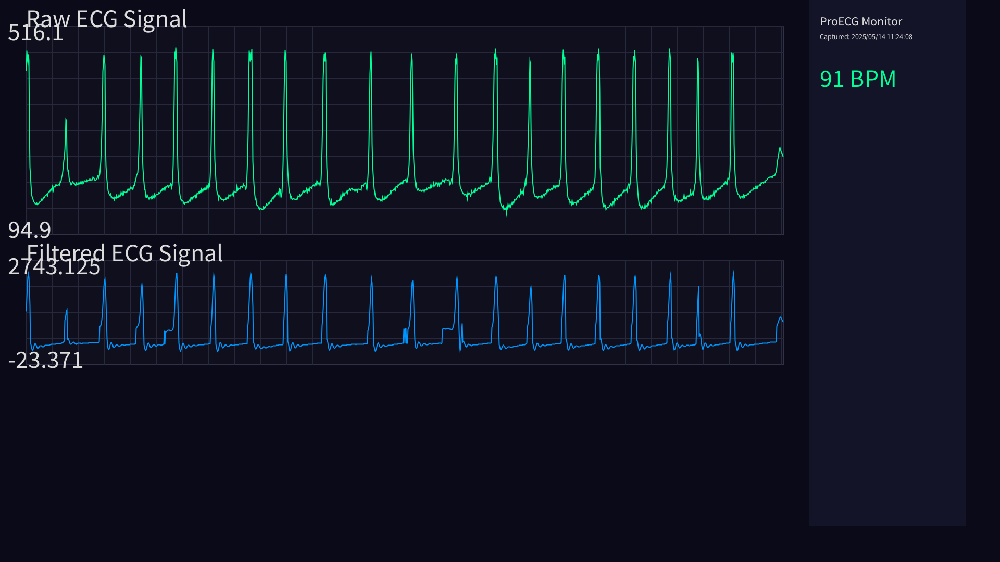
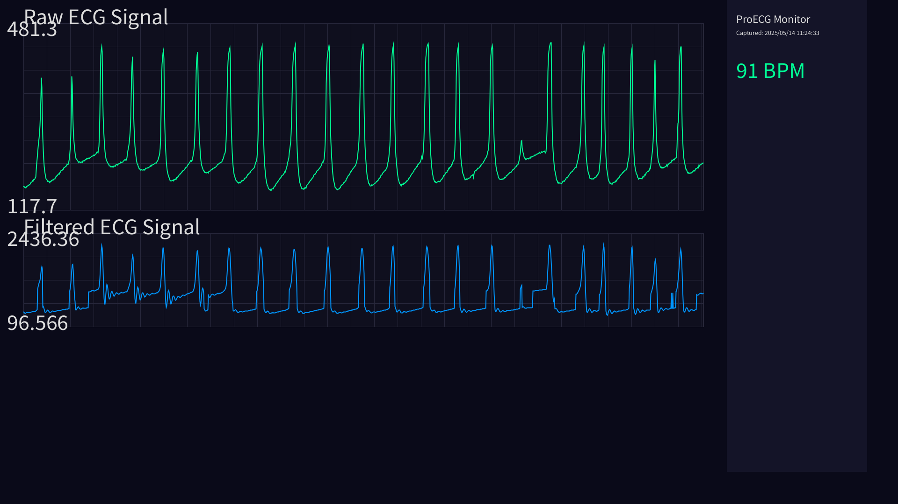

# ProECG: Advanced ECG Monitoring System

ProECG is a comprehensive electrocardiogram (ECG) monitoring system that provides real-time visualization, filtering, and analysis of heart activity. The project combines hardware interfacing, signal processing, and multi-platform visualization to create a complete solution for ECG monitoring.



## Features

- **Real-time ECG Visualization**: Displays live ECG waveforms with minimal latency
- **Advanced Signal Filtering**: Implements multiple filter types to clean noisy signals:
  - Adaptive notch filter for power line interference (50/60Hz)
  - Bandpass filtering to focus on cardiac frequencies
  - Low-pass filtering for smoothing
- **Automatic Heart Rate Detection**: Calculates BPM in real-time using R-peak detection
- **Dual Visualization Platforms**:
  - Processing-based desktop application with comprehensive controls
  - Web interface for remote monitoring from any device
- **Data Recording**: Save ECG data to CSV files for later analysis
- **Screenshot Capture**: Take snapshots of the ECG display for documentation
- **Lead-off Detection**: Alerts when electrodes are disconnected
- **Dynamic Scaling**: Automatically adjusts display range for optimal viewing
- **Adaptive Filtering**: Adjusts filter parameters based on signal quality

## System Components

The system consists of three main components:

1. **Arduino Interface** (TandMraw.ino): Connects to AD8232 heart monitor sensor and streams data
2. **Processing Visualization** (sketch_250514a.pde): Desktop application for advanced monitoring
3. **Web Interface** (app.py): Browser-based monitoring solution using Flask


## Hardware Requirements

- Arduino board (Uno, Nano, or similar)
- AD8232 Heart Monitor Sensor
- ECG electrodes (typically 3 leads)
- USB cable for Arduino-computer connection

## Software Requirements

- Arduino IDE (1.8+ recommended)
- Processing 3.5+
- Python 3.7+ with Flask
- Modern web browser (for web interface)

## Installation

### Arduino Setup

1. Connect the AD8232 sensor to Arduino:
   - AD8232 GND → Arduino GND
   - AD8232 3.3V → Arduino 3.3V
   - AD8232 OUTPUT → Arduino A0
   - AD8232 LO- → Arduino Digital Pin 11
   - AD8232 LO+ → Arduino Digital Pin 10
   - AD8232 SDN → Arduino Digital Pin 4

2. Install the TandMraw.ino sketch to your Arduino:
   ```
   1. Open TandMraw.ino in Arduino IDE
   2. Select your Arduino board and port
   3. Upload the sketch
   ```

### Processing Application

1. Install Processing from [processing.org](https://processing.org/download)
2. Open sketch_250514a.pde in Processing
3. Make sure ECGFilters.pde is in the same folder
4. Click Run to start the application

### Web Interface

1. Install required Python packages:
   ```bash
   pip install flask pyserial numpy
   ```
2. Run the Flask application:
   ```bash
   python app.py
   ```
3. Open a web browser and navigate to http://localhost:5001

## Usage Instructions

### Processing Application



- **Interface Controls**:
  - 'r' - Reset data
  - 's' - Save data to CSV
  - 'p' - Save screenshot
  - 'd' - Toggle debug info
  - 'f' - Toggle adaptive filtering mode
  - 't' - Toggle between raw+filtered and raw-only display
  - 'SPACE' - Toggle full screen mode

### Web Interface
[](https://ik.imagekit.io/uv6n96l6jw/videoplayback.mp4?updatedAt=1747510171174)


https://ik.imagekit.io/uv6n96l6jw/videoplayback.mp4


*Video: Web interface in action showing real-time ECG monitoring*

1. Select the appropriate port from the dropdown
2. Choose the baud rate (115200 recommended)
3. Click "Connect"
4. The ECG will display in real-time with heart rate below

## Signal Processing Details

The system employs multi-stage filtering to extract a clean ECG signal:

1. **Notch Filter**: Removes power line interference (50/60Hz)
2. **Bandpass Filter**: Preserves frequencies between 0.2Hz and 45Hz (cardiac range)
3. **Low-Pass Filter**: Smooths the signal without losing important features
4. **Adaptive Processing**: Adjusts filter parameters based on signal quality

## Sample ECG Recordings



The above image shows a typical ECG recording with labeled components:
- P wave
- QRS complex
- T wave 
- Heart rate calculation

## Data Storage

The system can save data in two formats:

1. **CSV Files**: Raw and filtered ECG values with timestamps
   ```
   Raw,Filtered
   521.00,498.32
   530.00,502.15
   ...
   ```

2. **PNG Screenshots**: Visual captures of the ECG display

## Troubleshooting

- **No Signal**: Check electrode placement and connections
- **Noisy Signal**: Ensure patient is relaxed, reduce movement, check electrode contact
- **No Serial Port Found**: Check USB connection, install drivers if needed
- **High Frequency Noise**: Try toggling adaptive filtering mode

## License

This project is open source and available under the MIT License.

## Contributors

- [Your Name or Organization]

## Acknowledgments

- Thanks to the Processing Foundation
- AD8232 Heart Monitor Sensor by SparkFun 
